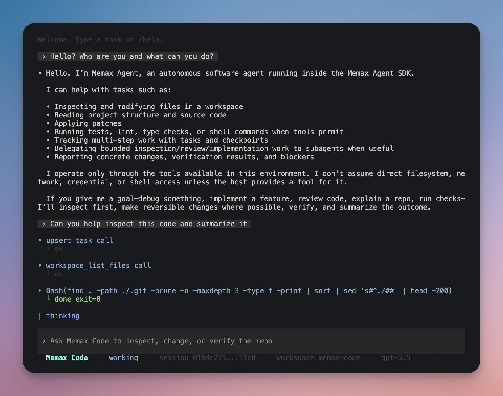

<br>

<p align="center">
  <a href="https://github.com/MemaxLabs/memax-code">
    
  </a>
</p>

<h1 align="center">Memax Code</h1>

<p align="center">
  A coding-agent CLI built on top of the Memax Go Agent SDK.
</p>

<p align="center">
  <a href="https://github.com/MemaxLabs/memax-go-agent-sdk">View the Memax Go Agent SDK</a>
</p>

<p align="center">
  <a href="./LICENSE"></a>
  
</p>

## Overview

Memax Code is the developer-facing CLI for the Memax coding agent stack.

This repository is intentionally separate from the SDK:

- the **SDK** owns the provider-neutral runtime and host-owned tool contracts
- the **CLI** owns the product surface: flags, workspace wiring, rendering,
  session UX, and policy defaults

## Highlights

- provider-neutral model profiles: `fast`, `balanced`, `deep`
- OpenAI and Anthropic provider adapters through the SDK
- root-confined workspace and command tools
- bounded `web_fetch` for HTTP(S) pages with private-network protections
- stdio MCP server tools loaded from local config
- managed command sessions for long-running processes
- bounded subagents for exploration, review, and isolated worker tasks
- automatic context compaction with model-visible summaries for long sessions
- JSONL-backed sessions with resume, listing, and transcript inspection
- local diagnostics with `memax-code doctor`
- interactive terminal shell with slash commands and prompt history recall
- multiple renderers: `app`, `live`, `tui`, `plain`, and machine-readable JSON

## Current status

**Foundation**.

The CLI is already usable for real workflows, with a solid interactive shell,
session persistence, structured tool rendering, verification hooks, and a
transcript-first terminal app surface. Approvals flow and deeper composer
behavior are follow-on slices.

## Screenshot

<p align="center">
  
</p>

## Installation

### Build from source

```sh
go build ./cmd/memax-code
```

### Development dependency note

The SDK dependency currently lives in the private `MemaxLabs` GitHub namespace.
If you are building from source in a development environment, configure Go and
git before dependency resolution:

```sh
gh auth setup-git
GOPRIVATE=github.com/MemaxLabs/* go test ./...
```

## Quick start

Inspect the resolved configuration without calling a model:

```sh
memax-code --dry-run --provider openai --profile deep --model gpt-5.4 "fix the failing tests"
```

Run with OpenAI:

```sh
export OPENAI_API_KEY=...
memax-code --provider openai --model gpt-5.4 "inspect the workspace and suggest the next change"
```

Run with Anthropic:

```sh
export ANTHROPIC_API_KEY=...
memax-code --provider anthropic --model claude-sonnet-4-5 "repair the test failure"
```

Start the interactive shell:

```sh
memax-code
memax-code --interactive
```

Check local setup:

```sh
memax-code doctor
memax-code doctor --config .memax-code/config.json --cwd .
```

> Flags must precede the prompt because the CLI currently uses Go's standard
> flag parser, which stops parsing flags at the first positional argument.

## Configuration

Persist local defaults in `~/.memax-code/config.json`:

```sh
memax-code config init --provider openai --model gpt-5.4 --ui auto
memax-code config show
```

Example config:

```json
{
  "provider": "openai",
  "model": "gpt-5.4",
  "profile": "balanced",
  "effort": "auto",
  "ui": "auto",
  "compaction": "auto",
  "context_window": 128000,
  "context_summary_tokens": 8192,
  "session_dir": "~/.memax-code/sessions",
  "history_file": "~/.memax-code/history.jsonl",
  "inherit_command_env": true,
  "web": true,
  "web_fetch_max_bytes": 524288,
  "mcp_servers": {
    "docs": {
      "command": "docs-mcp-server",
      "args": ["--stdio"],
      "env": {
        "DOCS_TOKEN": "..."
      },
      "inherit_env": false,
      "supports_parallel_tool_calls": true,
      "startup_timeout": "30s",
      "tool_timeout": "120s",
      "max_result_bytes": 131072,
      "max_rpc_message_bytes": 67108864
    }
  },
  "verify_commands": {
    "test": "npm test",
    "lint": "npm run lint"
  }
}
```

Use a project-local config when needed:

```sh
memax-code --config .memax-code/config.json --dry-run "inspect this repository"
```

Configuration precedence is:

```text
flag > environment > config file > built-in default
```

The default config file is optional. An explicitly supplied `--config` path
must exist and decode as strict JSON.

Long sessions compact automatically by default. `context_window` controls the
approximate token budget used before compaction, and `context_summary_tokens`
controls the summary budget. Compaction is persisted as an active-session
checkpoint: the raw JSONL transcript remains available for inspection, while
future model turns continue from the summary checkpoint plus newer messages
instead of re-summarizing the same old prefix repeatedly. The local estimator is
conservative because provider tokenizers differ; the runtime preserves headroom
rather than risking a provider context-window error. The CLI uses hysteresis:
it compacts down to a target budget, then waits for the transcript to grow past
a higher trigger budget before summarizing again. Set `"compaction": "off"` or
pass `--compaction off` to disable this behavior for debugging. In the
interactive shell, `/context` shows the active context budgets, raw transcript
message count, model-visible message count, and latest persisted checkpoint.
The displayed budget is the configured or registry-derived planning budget; a
live provider client may still report a more specific limit when a turn is sent.
Human transcript renderers keep routine context-selection telemetry quiet and
only show actual compaction rows, for example
`~ context compacted 19 -> 8 messages`; `plain` and `--event-stream json`
continue to expose the detailed per-turn context counts for wrappers and logs.

## Interactive shell

On a real terminal, running `memax-code` with no prompt opens the interactive
shell automatically.

Inside the shell, normal prompts continue the current session. Slash commands
control local state without calling a model:

```text
/help
/status
/context
/mcp
/pick
/show latest
/sessions
/resume latest
/resume 1
/draft Refactor this package
/append Preserve public API behavior
/show-draft
/submit
/history
/recall latest
/session
/new
/quit
```

Submitted prompts are stored separately from session transcripts in JSONL-backed
history so recall works across shell restarts.

## Sessions

Session transcripts are stored under `~/.memax-code/sessions` by default.
Prompt recall history is stored separately under `~/.memax-code/history.jsonl`.

Useful commands:

```sh
memax-code --list-sessions
memax-code --show-session latest
memax-code --resume latest
memax-code --resume latest "continue the most recent active session"
```

When `--resume` is provided without a prompt on a real terminal, Memax Code
reopens that session in the interactive shell.

## Rendering and event streams

Memax Code supports several renderers:

- `auto`: default; uses the transcript-first app renderer on terminals
- `app`: styled interactive terminal app with normal scrollback
- `live`: transcript-first terminal mode with a transient status line
- `tui`: structured/raw sectioned output
- `plain`: stable log-oriented output
- `--event-stream json`: JSONL event stream for wrappers and tooling

Examples:

```sh
memax-code --ui auto "repair the failing test"
memax-code --ui live "repair the failing test"
memax-code --ui tui "inspect the failing test"
memax-code --ui plain "run the relevant checks" > run.log
memax-code --event-stream json "repair the failing test"
```

`--ui auto` is the default. It uses app mode for interactive terminals and the
plain renderer for non-terminal output. Terminal history stays in normal
scrollback; Memax Code does not enter a full-screen alternate buffer. Existing
configs that set `"ui": "app"` keep the same styled terminal behavior.

## Safety and execution model

### Web access

The built-in `web_fetch` tool is bounded and intended for explicit HTTP(S)
retrieval. It:

- strips URL credentials before requests
- follows a small number of redirects
- blocks loopback, link-local, multicast, unspecified, and private-network
  addresses
- can be disabled with `--no-web` or config `"web": false`

The response cap is configurable with `--web-fetch-max-bytes` and limited to
4 MiB.

### MCP servers

Memax Code can load stdio MCP servers from config and expose their advertised
tools to the model as normal Memax tools. Tool names use
`mcp__<server>__<tool>` so they remain namespaced and collision-resistant.

Add, inspect, and remove servers with:

```sh
memax-code mcp add docs --env DOCS_TOKEN=... --startup-timeout 30s --tool-timeout 120s -- docs-mcp-server --stdio
memax-code mcp list
memax-code mcp remove docs
```

Inside the interactive shell, `/mcp` shows the configured servers. Disabled
servers stay in config but are not started. `supports_parallel_tool_calls`
should only be enabled for servers whose tools are safe to call concurrently.
MCP servers do not inherit the full parent process environment by default; pass
secrets explicitly with `--env KEY=VALUE`, or use `--inherit-env` only for
trusted local servers. MCP startup, tool calls, result sizes, and JSON-RPC
message sizes are bounded by SDK defaults; config can override them with
`startup_timeout`, `tool_timeout`, `max_result_bytes`, and
`max_rpc_message_bytes`. Interactive sessions start configured MCP servers once
and reuse the discovered tools across turns.

### Verification

Go workspaces with a root `go.mod` automatically enable built-in verification,
including `go test ./...` and `go vet ./...`, unless custom verification
commands are configured.

Project-specific checks can be supplied with `--verify-command`:

```sh
memax-code --verify-command 'test=npm test' \
  --verify-command 'lint=npm run lint' \
  "make the failing lint and test checks pass"
```

### Command environment inheritance

By default, command tools inherit the host process environment so local
toolchains and normal developer shell behavior work out of the box. Disable it
when you want a cleaner or lower-trust execution environment:

```sh
memax-code --no-inherit-command-env "run the relevant tests and fix failures"
```

## Subagents

Memax Code registers a built-in `run_subagent` tool with three bounded child
profiles:

- `explorer`: read-only repository investigation
- `reviewer`: read-only bug/regression review with verification evidence
- `worker`: isolated implementation work with edit, command, and verification
  tools

Child runs use the same provider/model selection and session store as the
parent, but do not receive `run_subagent`, so delegation stays bounded and does
not recurse accidentally.

## Repository layout

```text
cmd/memax-code/    CLI entrypoint
internal/cli/      CLI runtime, rendering, config, shell, and tool plumbing
```

## Development

Run tests:

```sh
GOPRIVATE=github.com/MemaxLabs/* go test ./...
```

Run the CLI locally:

```sh
GOPRIVATE=github.com/MemaxLabs/* go run ./cmd/memax-code --dry-run "summarize this repository"
```

## Environment variables

- `MEMAX_CODE_PROVIDER`
- `MEMAX_CODE_CONFIG`
- `MEMAX_CODE_PROFILE`
- `MEMAX_CODE_EFFORT`
- `MEMAX_CODE_PRESET`
- `MEMAX_CODE_UI`
- `MEMAX_CODE_SESSION_DIR`
- `MEMAX_CODE_HISTORY_FILE`
- `MEMAX_CODE_INHERIT_COMMAND_ENV`
- `MEMAX_CODE_WEB`
- `MEMAX_CODE_WEB_FETCH_MAX_BYTES`
- `MEMAX_CODE_VERIFY_COMMANDS`
- `OPENAI_API_KEY`
- `OPENAI_MODEL`
- `ANTHROPIC_API_KEY`
- `ANTHROPIC_MODEL`

Relative paths in flags, environment variables, and config files resolve
against the process working directory at startup.

## License

This project is licensed under the **Apache License 2.0**. See [LICENSE](./LICENSE).
